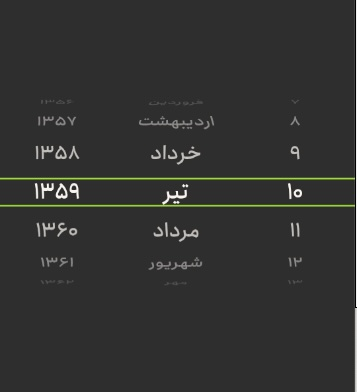

# 📆 React Native Android Persian Wheel Picker

A customizable Persian (Jalali) wheel picker component for React Native Android applications.

## Installation

```bash
# Install the package
npm install react-native-android-persian-wheel-picker
# or
yarn add react-native-android-persian-wheel-picker

# Install the required peer dependency
npm install react-native-wheel-pick
# or
yarn add react-native-wheel-pick

# For React Native >= 0.60, the linking is automatic
# For React Native < 0.60, you need to link manually:
react-native link react-native-wheel-pick
```

## Font Configuration

To support Persian (or any other custom) fonts in the wheel picker, you need to define the font in your Android styles. Add the following to your `android/app/src/main/res/values/styles.xml` file:

```xml
<resources>
    <style name="AppTheme" parent="Theme.AppCompat.DayNight.NoActionBar">
        <!-- ... other styles ... -->
        <item name="wheel_font_path">fonts/your_persian_font</item>
    </style>
</resources>
```

Make sure to:

1. Place your font file in the `android/app/src/main/res/font/` directory
2. Reference the font file name (without extension) in the `wheel_font_path` attribute
3. If the `font` directory doesn't exist, create it first

Without this configuration, the wheel picker will not display Persian text correctly.

## Demo



## Usage

```tsx
import { PersianWheelPicker } from "react-native-android-persian-wheel-picker";

const MyComponent = () => {
  const handleDateChange = (date: {
    year: number;
    month: number;
    day: number;
  }) => {
    console.log("Selected date:", date);
  };

  return (
    <PersianWheelPicker
      yearRange={{ start: 1330, end: 1400 }}
      onChange={handleDateChange}
      selectLineColor="#A3E635"
      selectLineSize={4}
    />
  );
};
```

## Props

| Prop            | Type                                                         | Default                          | Description                       |
| --------------- | ------------------------------------------------------------ | -------------------------------- | --------------------------------- |
| initialDate     | `{year: number; month: number; day: number}`                 | `{year: 1370, month: 1, day: 1}` | Initial selected date             |
| yearRange       | `{start: number; end: number}`                               | `{start: 1330, end: 1400}`       | Range of years to display         |
| containerStyle  | `ViewStyle`                                                  | -                                | Custom styles for the container   |
| pickerStyle     | `ViewStyle`                                                  | -                                | Custom styles for the picker      |
| textStyle       | `TextStyle`                                                  | -                                | Custom styles for the picker text |
| selectLineColor | `string`                                                     | `'#A3E635'`                      | Color of the selected line        |
| selectLineSize  | `number`                                                     | `4`                              | Size of the selected line         |
| monthNames      | `string[]`                                                   | Persian month names              | Custom month names                |
| onChange        | `(date: {year: number; month: number; day: number}) => void` | -                                | Callback when date changes        |

## Customization Example

```tsx
<PersianWheelPicker
  yearRange={{ start: 1350, end: 1400 }}
  containerStyle={{ backgroundColor: "#1a1a1a" }}
  pickerStyle={{ backgroundColor: "#2a2a2a" }}
  textStyle={{ color: "#ffffff", fontSize: 16 }}
  selectLineColor="#FF0000"
  selectLineSize={2}
  onChange={(date) => console.log(date)}
/>
```

## Troubleshooting

If you encounter any issues with the installation:

1. Make sure you have the latest version of React Native installed
2. Make sure you have installed both packages:
   ```bash
   npm install react-native-android-persian-wheel-picker react-native-wheel-pick
   # or
   yarn add react-native-android-persian-wheel-picker react-native-wheel-pick
   ```
3. Try cleaning your project:
   ```bash
   cd android && ./gradlew clean
   cd .. && npm start -- --reset-cache
   ```
4. If you see the error "WheelCurvedPicker was not found in the UIManager", make sure you have properly installed and linked `react-native-wheel-pick`

## License

MIT
